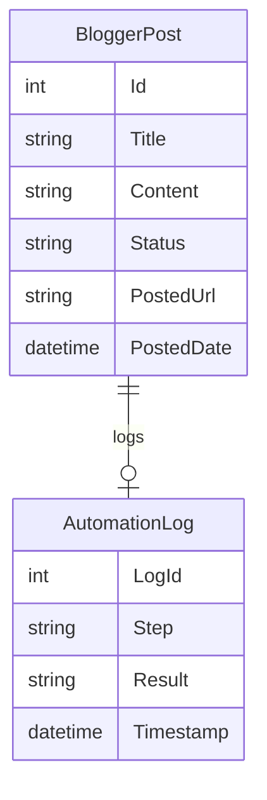

# BloggerSelenium

**BloggerSelenium** is an ASP.NET/C# project that automates posting content to Blogger blogs using Selenium WebDriver. Unlike traditional approaches that use the Blogger API, this project directly controls a web browser to log in and publish posts, making it ideal for cases where API access is restricted or unavailable.

---

## Features

- **Automated Blogger Posting:** Uses Selenium WebDriver to programmatically create and publish posts on Blogger.
- **No API Required:** Works via browser automation; no need for Blogger API keys or OAuth.
- **Rich Content Support:** Can fill in titles, post bodies, and optionally upload images just like a real user.
- **Error Handling & Logging:** Tracks browser actions, login status, and post results for audit and troubleshooting.
- **Flexible Automation:** Easily adapts to different Blogger accounts and blogs.

---

## Technologies Used

- **ASP.NET Web Forms / C#:** Core application logic and web interface.
- **Selenium WebDriver:** For browser automation and interaction with Blogger.
- **ChromeDriver / GeckoDriver:** To launch and control Chrome or Firefox browsers.
- **Newtonsoft.Json:** For configuration or logging (optional).
- **HtmlAgilityPack:** For parsing HTML content (optional).

---

## Typical Workflow

1. **Configure Credentials:** Enter Blogger account details and blog URLs in the app settings or UI.
2. **Prepare Post Content:** Input titles, bodies, and optional images in the interface.
3. **Automated Login:** Selenium logs into Blogger using provided credentials.
4. **Publish Post:** Selenium fills out the post form and publishes the content.
5. **Status & Logging:** Application records each automation step and the final post URL or any errors.

---

## Example Code Snippet

```csharp
using OpenQA.Selenium;
using OpenQA.Selenium.Chrome;

var options = new ChromeOptions();
options.AddArgument("--start-maximized");
using (var driver = new ChromeDriver(options))
{
    driver.Navigate().GoToUrl("https://www.blogger.com/");
    // Login steps
    driver.FindElement(By.Id("identifierId")).SendKeys("your_email");
    driver.FindElement(By.Id("identifierNext")).Click();
    // ... continue login flow

    // Go to blog post page
    driver.Navigate().GoToUrl("https://www.blogger.com/blog/post/edit/your_blog_id");
    driver.FindElement(By.Name("title")).SendKeys("Automated Title");
    driver.FindElement(By.Name("body")).SendKeys("Automated content here...");
    driver.FindElement(By.XPath("//button[contains(text(), 'Publish')]")).Click();
    // Capture posted URL or status
}
```

---

## Data Model (ER Diagram Example)



---

## Getting Started

1. Clone the repository.
2. Install Selenium WebDriver and the required browser driver (ChromeDriver, etc.).
3. Configure Blogger credentials and blog URLs in the app.
4. Run the application and use the UI to input post content and trigger automation.

---

## License

This project uses open-source libraries (`Selenium.WebDriver`, etc.).
See individual library documentation for licensing details.

---

## Author

Ashish Saurav

---

## Contributing

Pull requests, feature suggestions, and bug reports are welcome.
